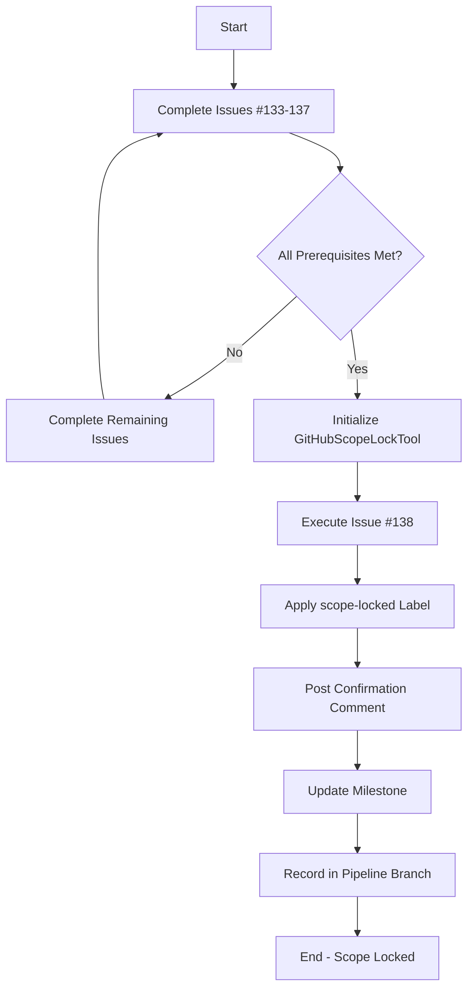

# Scope Lock & Tag Mechanism (Issue #138)

## Overview

The Scope Lock & Tag mechanism is a formal process to prevent uncontrolled scope creep by locking the requirements and features for a release. This is implemented through the `GitHubScopeLockTool`, which integrates with GitHub's API to add labels, comments, and milestone tracking.

## Purpose

**Goal**: Prevent uncontrolled scope creep by formally locking the scope of a release.

**When to Use**:
- After all requirement specifications have been defined and reviewed
- Before starting major implementation work
- When stakeholder consensus has been reached on the feature set
- As part of release planning to establish clear boundaries

## How It Works

The scope locking process involves three main actions:

1. **Add Label**: Applies a `scope-locked` label to the target GitHub issue
2. **Post Comment**: Adds a confirmation comment explaining the scope lock and its implications
3. **Update Milestone**: Associates the issue with a specific release milestone (e.g., v1.0)

### Prerequisites

Before applying a scope lock, ensure:

- ✅ **Issue #134**: Must-Have Feature List is completed
- ✅ **Issue #135**: Non-Functional Requirements (NFRs) are defined
- ✅ **Issue #136**: KPIs & Acceptance Criteria are established
- ✅ **Issue #137**: Stakeholder Review Loop has been completed
- ✅ All specifications have been merged and reviewed

## Usage

### Basic Usage with Epic Branch Orchestrator

```csharp
using LangChainPipeline.Agent.MetaAI;
using LangChainPipeline.Tools;
using LangChainPipeline.Core.Monads;

// Initialize the scope lock tool
string githubToken = Environment.GetEnvironmentVariable("GITHUB_TOKEN");
var scopeLockTool = new GitHubScopeLockTool(githubToken, "PMeeske", "Ouroboros");

// Initialize epic orchestrator
var safetyGuard = new SafetyGuard(PermissionLevel.Isolated);
var distributor = new DistributedOrchestrator(safetyGuard);
var epicOrchestrator = new EpicBranchOrchestrator(distributor);

// Register Epic #120
await epicOrchestrator.RegisterEpicAsync(
    120,
    "Production-ready Release v1.0",
    "Epic tracking v1.0 release",
    new List<int> { 138 }
);

// Execute Issue #138 - Lock & Tag Scope
var result = await epicOrchestrator.ExecuteSubIssueAsync(
    120,
    138,
    async assignment =>
    {
        // Apply scope lock to issue #2
        var lockArgs = System.Text.Json.JsonSerializer.Serialize(new
        {
            IssueNumber = 2,
            Milestone = "v1.0"
        });
        
        var lockResult = await scopeLockTool.InvokeAsync(lockArgs);
        
        if (!lockResult.IsSuccess)
        {
            return Result<SubIssueAssignment, string>.Failure(
                $"Scope lock failed: {lockResult.Error}");
        }
        
        // Record the scope lock in the pipeline branch
        if (assignment.Branch != null)
        {
            var updatedBranch = assignment.Branch.WithIngestEvent(
                "scope-lock-applied",
                new[] { "issue-2-locked", "milestone-v1.0", "label-scope-locked" }
            );
            
            updatedBranch = updatedBranch.WithReasoning(
                new FinalSpec("Scope formally locked for v1.0 release"),
                "Apply scope lock",
                null
            );
            
            return Result<SubIssueAssignment, string>.Success(
                assignment with { Branch = updatedBranch }
            );
        }
        
        return Result<SubIssueAssignment, string>.Success(assignment);
    }
);
```

### Direct Usage (Without Epic Orchestrator)

```csharp
using LangChainPipeline.Tools;

// Initialize the tool
string githubToken = Environment.GetEnvironmentVariable("GITHUB_TOKEN");
var scopeLockTool = new GitHubScopeLockTool(
    githubToken,
    owner: "PMeeske",
    repo: "Ouroboros"
);

// Lock scope for issue #2 with milestone v1.0
var lockArgs = System.Text.Json.JsonSerializer.Serialize(new
{
    IssueNumber = 2,
    Milestone = "v1.0"
});

var result = await scopeLockTool.InvokeAsync(lockArgs);

if (result.IsSuccess)
{
    Console.WriteLine("✅ Scope locked successfully!");
    Console.WriteLine(result.Value);
}
else
{
    Console.WriteLine($"❌ Failed: {result.Error}");
}
```

### Without Milestone

If you don't want to update the milestone, simply omit it from the arguments:

```csharp
var lockArgs = System.Text.Json.JsonSerializer.Serialize(new
{
    IssueNumber = 2
});

var result = await scopeLockTool.InvokeAsync(lockArgs);
```

## Configuration

### GitHub Token Setup

The `GitHubScopeLockTool` requires a GitHub personal access token with `repo` permissions:

1. Go to GitHub Settings → Developer settings → Personal access tokens
2. Generate a new token (classic)
3. Select the `repo` scope (Full control of private repositories)
4. Copy the token and store it securely
5. Set the environment variable:

```bash
export GITHUB_TOKEN=your_token_here
```

### Tool Parameters

The tool accepts the following parameters:

| Parameter | Type | Required | Description |
|-----------|------|----------|-------------|
| `IssueNumber` | integer | Yes | GitHub issue number to lock |
| `Milestone` | string | No | Milestone name (e.g., "v1.0") to assign |

## Output

When successful, the tool returns a summary message:

```
✅ Scope locked for issue #2
  - Label 'scope-locked' added
  - Confirmation comment posted
  - Milestone updated to: v1.0
```

### GitHub Changes

The tool makes the following changes on GitHub:

1. **Label**: Creates (if needed) and applies the `scope-locked` label with:
   - Color: `#D4C5F9` (light purple)
   - Description: "Scope is locked to prevent uncontrolled scope creep"

2. **Comment**: Posts a comment explaining the scope lock:
   ```
   🔒 **Scope Locked**

   The scope of this issue has been formally locked to prevent uncontrolled scope creep.

   **What this means:**
   - No new requirements can be added without explicit approval
   - Changes to existing requirements require scope change review
   - This ensures predictable delivery timelines

   **Milestone:** v1.0

   To request scope changes, please open a new issue and reference this locked scope.
   ```

3. **Milestone**: Updates the issue's milestone to the specified value

## Integration with Epic #120 Workflow

Issue #138 is part of the Requirements & Scope category in Epic #120. It depends on:

- **Issue #133**: Aggregate Existing Discussions
- **Issue #134**: Define Must-Have Feature List
- **Issue #135**: Non-Functional Requirements (NFRs)
- **Issue #136**: KPIs & Acceptance Criteria
- **Issue #137**: Stakeholder Review Loop

Once all these prerequisites are complete, Issue #138 can be executed to formally lock the scope.

## Error Handling

The tool follows the monadic `Result<TValue, TError>` pattern for robust error handling:

```csharp
var result = await scopeLockTool.InvokeAsync(lockArgs);

if (result.IsSuccess)
{
    // Success case
    Console.WriteLine(result.Value);
}
else
{
    // Failure case
    Console.WriteLine($"Error: {result.Error}");
}

// Or use monadic bind operations
result
    .Map(value => $"Success: {value}")
    .Match(
        success => Console.WriteLine(success),
        failure => Console.WriteLine($"Error: {failure}")
    );
```

### Common Errors

| Error | Cause | Solution |
|-------|-------|----------|
| "Failed to add label: 401 Unauthorized" | Invalid GitHub token | Verify token has `repo` permissions |
| "Failed to update milestone: Milestone 'vX.X' not found" | Milestone doesn't exist | Create milestone on GitHub first |
| "Failed to add comment: 404 Not Found" | Issue number doesn't exist | Verify the issue number is correct |
| "Scope lock failed: Unable to deserialize JSON" | Invalid input format | Ensure JSON matches expected schema |

## Best Practices

1. **Timing**: Apply scope lock after all requirement gathering is complete but before implementation begins
2. **Communication**: Notify all stakeholders before applying the scope lock
3. **Documentation**: Ensure all specifications are documented and merged before locking
4. **Change Control**: Establish a clear process for handling scope change requests after locking
5. **Visibility**: Use the GitHub label to make the scope lock visible to all team members

## Example Workflow

Here's a complete workflow for Issue #138:



## Testing

The `GitHubScopeLockTool` includes comprehensive unit tests:

```bash
# Run all tests
dotnet test --filter "FullyQualifiedName~GitHubScopeLockToolTests"

# Run specific test
dotnet test --filter "JsonSchema_ReturnsValidSchema"
```

### Integration Testing

For integration testing with actual GitHub API:

```bash
# Set GitHub token
export GITHUB_TOKEN=your_token_here

# Run the example
dotnet run --project src/Ouroboros.Examples -- --example Issue138ScopeLock
```

## See Also

- [Epic120Integration.md](Epic120Integration.md) - Complete Epic #120 workflow
- [EpicBranchOrchestration.md](EpicBranchOrchestration.md) - Epic orchestration system
- [Issue138ScopeLockExample.cs](../src/Ouroboros.Examples/Examples/Issue138ScopeLockExample.cs) - Working code example
- [GitHubScopeLockTool.cs](../src/Ouroboros.Tools/Tools/GitHubScopeLockTool.cs) - Implementation details
- [GitHubScopeLockToolTests.cs](../src/Ouroboros.Tests/Tests/GitHubScopeLockToolTests.cs) - Test suite

## Contributing

To extend the scope locking mechanism:

1. Follow the functional programming patterns established in the codebase
2. Use `Result<TValue, TError>` monad for error handling
3. Implement `ITool` interface for new tools
4. Add comprehensive unit tests
5. Update documentation

## License

This implementation is part of the Ouroboros project. See [LICENSE](../LICENSE) for details.
